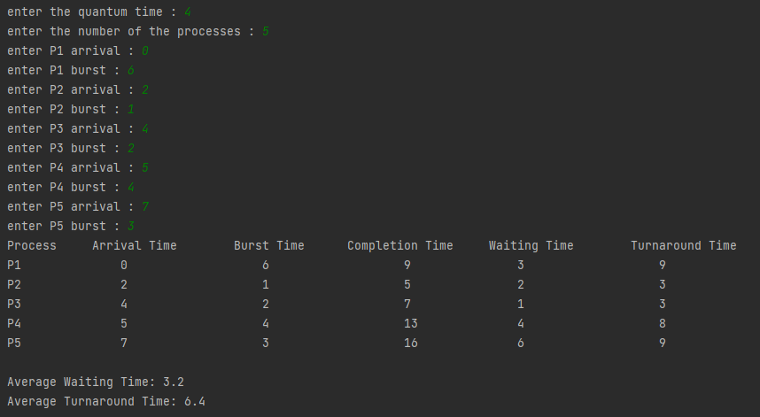
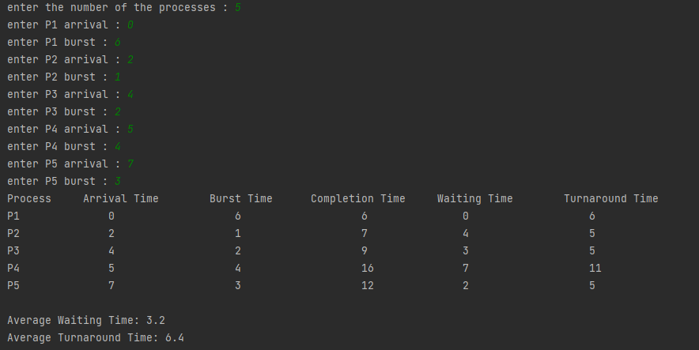

# CPU scheduling algorithms RR and SJF implementation using Python

## RR Algorithm
The Round-Robin (RR) algorithm is a widely used CPU scheduling technique. It schedules processes by giving each process a fixed time slice, called a quantum, and switches to the next process in the queue when the time slice expires. This ensures fairness and responsiveness. 
<a href="https://github.com/AhmedHosniFahmi/RR_SJF_python_implementation/blob/main/RR.py" target="_blank"> RR.py </a>

## SJF Algorithm
The Shortest Job First (SJF) algorithm is a non-preemptive CPU scheduling technique that schedules processes based on their expected CPU burst time. Processes with the shortest expected CPU burst time are executed first, minimizing average waiting time and turnaround time. <a href="https://github.com/AhmedHosniFahmi/RR_SJF_python_implementation/blob/main/SJF.py" target="_blank"> SJF.py </a>

